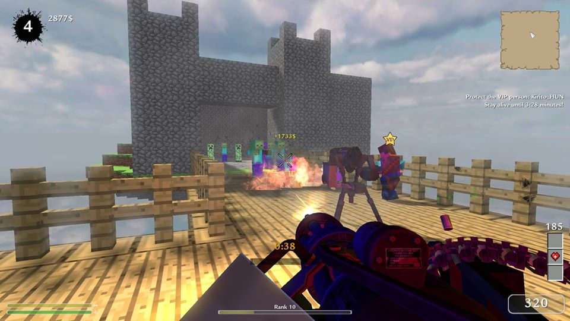
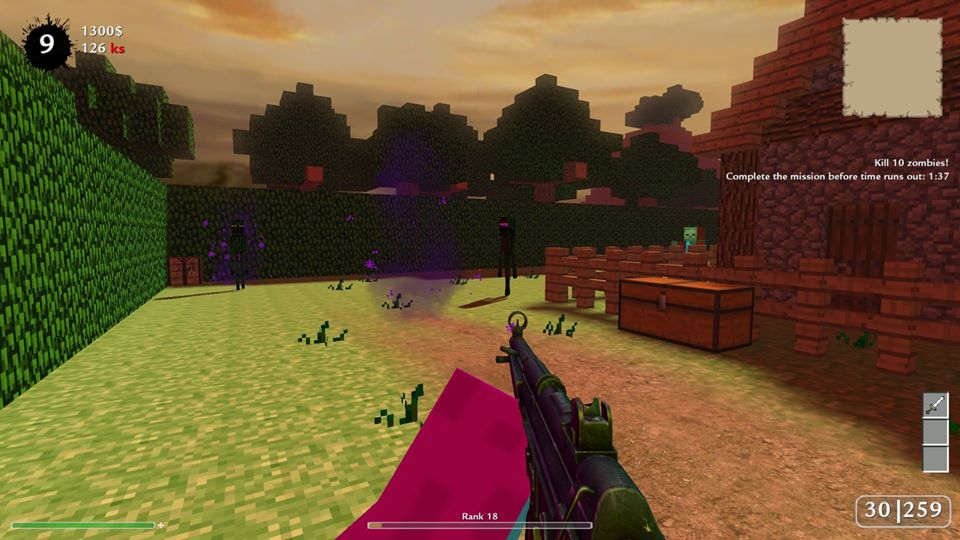

# CoD2 MC botmod
Call of Duty 2 1.3 Minecraft botmod



[Mod tool documentation](mod_tools/README.md)

## Installation
First of all download the latest [release](https://github.com/kodaniel/CoD2-MC-botmod/releases).

Add an `mcbotmod` subfolder in the Call of Duty 2 root directory and unpack the downloaded .zip file into that.

For example: `C:\Program Files (x86)\Activision\Call of Duty 2\mcbotmod`

Create a shortcut to the COD2_MP.exe and in the properties add the `+set fs_game mcbotmod` attribute after the target.
*\"C:\Program Files (x86)\Activision\Call of Duty 2\CoD2MP_s.exe\" +set fs_game mcbotmod*

Now when you start the game it will load the mod files from the `mcbotmod` folder.

### Limitations

Some features won't work on localhosted game, like account system and map records.
Install the mod on a proper game hosting service to enjoy the mod in its entirety.

## Features

- 19 various, Minecraft styled custom maps.
- 41 guns from WW2 to modern warfare. Bow, panzerschreck and special weapons with unique abilities. E.g. the bow's damage increases wave by wave, the wunderwaffe shocks more enemies in the near, the raygun slows down zombies.
- 9 types of enemies with special behaviours.
- 6 perks, like double health, quickreload, a pet :), and so on...
- 10 power ups such as max ammo, instakill, resurrection, random weapon.
- 3 different player classes with special abilities: hunter, doctor and banker.
- 6 kind of missions.
- 4 kind of end-game bosses.
- 5 killstreaks, c4 bomb, airstrike, sentry gun, ...

And many more things like account system, end map vote, mystery boxes and so on.

## Map list

- mc_atlantis
- mc_babylon
- mc_bridge
- mc_burgundy
- mc_case
- mc_falvedo
- mc_farm
- mc_fos
- mc_kapazin
- mc_library
- mc_maya
- mc_skyscraper
- mc_skyville
- mc_snowmaze
- mc_survivalwest
- mc_underworld
- mc_untoten
- mc_village
- mc_wintervillage

## Cvar list

```c
// Price of the weapons
scr_botmod_mysteryBoxPrice "800"
// Chance of drop a powerup [0-100]
scr_botmod_powerup_odds "6"
```

#### Classic gametype
```c
// Difficulty; 1 = hardest
scr_botmod_difficulty "4"
// Round length in minutes
scr_botmod_timelimit "5"
// Grace period in seconds
scr_botmod_readyuptime "40"
// Max AIs on the map
scr_botmod_npclimit "32"
// Number of rounds
scr_botmod_roundlimit "12"
// AI base health multiplier
scr_botmod_healthmultiplier "1"
```

#### Horde mode (beta)
Infinite number of rounds. The horde mode is in beta, no boss round are coming so players can't level up.

```c
// Round length in minutes
scr_horde_difficulty "10"
// Grace period in seconds
scr_horde_readyuptime "40"
// Max AIs on the map
scr_horde_npclimit "32"
// Number of rounds
scr_horde_bossroundnum "12"
// AI base health multiplier
scr_horde_healthmultiplier "0.5"
```

## Special thanks
- to **oma.Spencer** for importing the minecraft models to CoD2
- to **PetX** and **HoEK** the custom weapon models
- and to **UnaRkW** for creating mc_farm, mc_wintervillage and re-design mc_library

