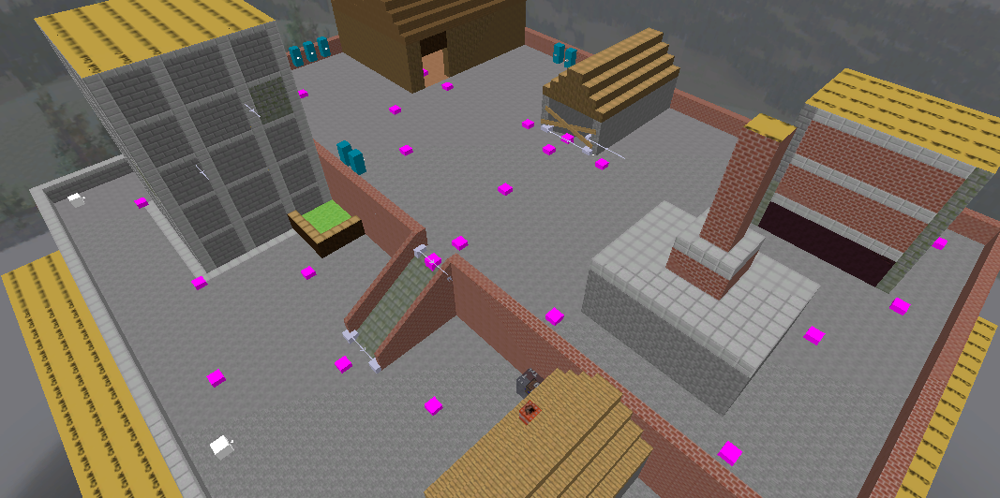
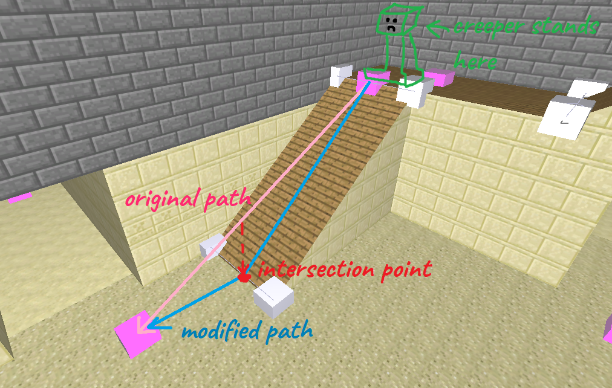
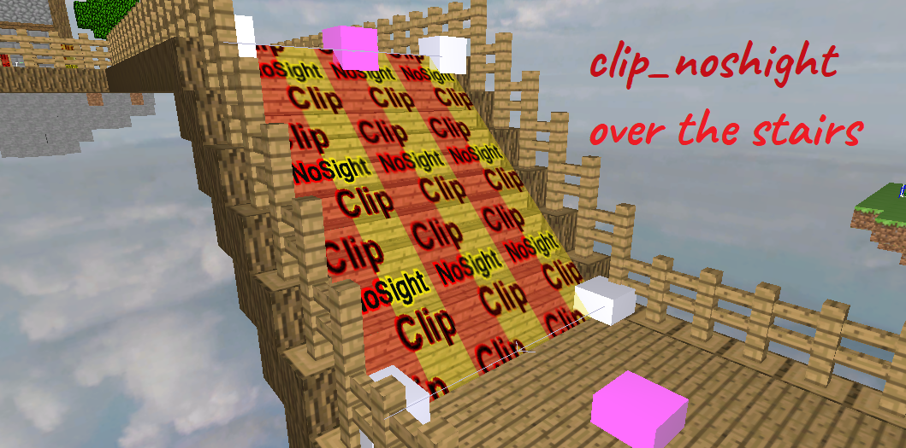
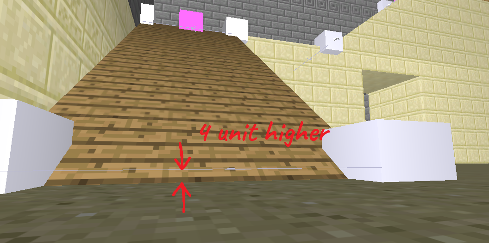
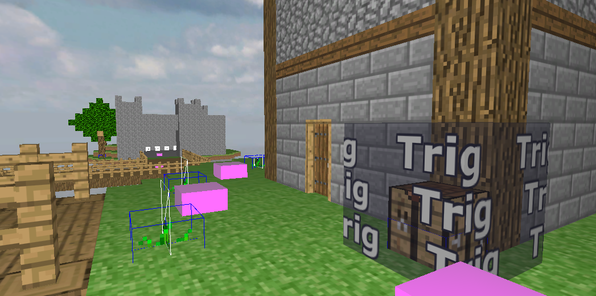

# Overview

## Preparations

First of all you need to download and install the CoD2 Mod Tools, which is available on ModDb.
https://www.moddb.com/games/call-of-duty-2/downloads/call-of-duty-2-mod-tools

Then download the necessary assets from this repository.
Copy the **map_source** folder into the Call of Duty 2 root and the **zbot_maptools.iwd** file into the *main* subfolder.
The *map_source* includes every map file I created and the prefabrications, such as the required tools like the hitbox group, mystery box and chest, or pre-made elements like trees and houses.
The iwd file contains the textures and the spawnpoints.

## Level editing

### Nodes

The game's script engine has very limited resources and poor performance, therefore the AI paths are calculated once at the beginning of the game and stored in a huge in-memory array.
The maximum array size in CoD2's gamescript is 4096, so the maximum number of waypoints you can place is 64 (it is the square root of 4096). If you exceed this number, you will get a scripting error.
In most cases the 64 waypoints are enough, but in large and complex structured maps it is easy to run out, so place waypoints only where it is necessary.

A good practice is to place waypoints on each corners. Every places on the map should be visible at least from one waypoints, otherwise the bots won't find the player and the gameplay will be ruined. So be careful and plan well the waypoint web.

Use the **node_pathnode** to create a new waypoint. Align the nodes to the ground. If the nodes are collapses into the ground, the path generation will fail!
If you don't want to count the nodes one by one, press the button *M* to view the map info.

### Ramps and stairs

If you are ambitious and don't want to make only flat maps, it is possible to create ramps or stairs.
Unfortunately it is a bit more complicated then placing pathnodes since it needs some special nodes too. But do not scare, it is not so horrible.
Basically the bots can move fairly well on flat surfaces on the XY plane. To understand why it is a problem to move on slopes, first you need to understand how the AI pathfinding works.
Every bot and player has a closest waypoint, which is updated by a random frequency between 0.5 and 1.0 seconds. It is configured in the [_ai.gsc](https://github.com/kodaniel/CoD2-MC-botmod/blob/035817719148740e610b295dcc0df07988394c24/scripts/_ai.gsc#L5) file. On every update the path is picked from the precalculated array.
The bot will move along on this path. A path means a chain of waypoints. The bot always goes to the **furthest visible waypoint**. And here comes the challenge.
When for eg. the bot is on the top stairs, the bot starts to move straight on the furthest waypoint, which is often not on the bottom of the stairs. Therefore the bot will "fly" and not aligned to the ground.
It could have been a good solution to find the ground with raytracing, but it has two problems:
1. The path's refresh rate is too low, between 0.5 and 1.0 seconds. Depends on the bot's speed, it is not enough.
2. The raytracing is the most slowest function in CoD game scripting. (ok, maybe the distance calculation is heavier, I didn't make benchmarks)

So if I decide to increase the refresh rate, that leads to performance issues and server lagging.

Then how to align the bots to the ground? The proper solution is based on the intersection of two lines:
The bot's path is known, that is one line. The second line must be placed where the flat surface breaks. In my example, on the bottom of the stairs.
Now it is able to calculate the bottom of the slope, and when the bot's path intersects a virtual line, then a new waypoint will be inserted into the path.

To create this virtual line, place two **node_sripted** nodes on the bottom edges of the ramp or stairs. Then bind it together: select the first, then the second node and press *W*.
An arrow will appear between the nodes. The direction does not matter.

This method has a big disadvantage: It is not able to place stairs on top of each other, so you can't make a 10-floor staircase for example.
The reason is the script does not check which virtual line intersects and may calculate with a wrong line. Keep this in your mind when planning your map!

Good practices:
- When creating stairs instead of a ramp, make a **clip_nosight** brush over it. It prevent to stuck the bot between the steps.
- Always raise the bottom node_scripted from the ground a bit. 4 units is enough. The reason behind it, in some cases the bots move over the intersection point and run into the ground due to math rounding errors.

### Clips

There are cases almost on every map when you need to close some area off from the human or AI players. For example you want to prevent to getting the players outside the map.
Also a common use case is when you make fences on the map, but don't want that the bots "see" through on it.
Since the bots are following the players when they see it, it can cause unexpected behaviours, like going through the walls.

To prevent these events, you have to use special textures:
- **clip_nosight**: Both the bots and players can't walk through it.
- **nosight_noclip**: Only the players can walk through it, the bots can't.
- **clip_player**: Opposite of the *nosight_noclip*. The bots can walk through it, but the players can't.

### Spawnpoints

There are two kind of spawnpoints in the mod: human and bot spawns.
- **bz_playerspawn**: Where the human players are spawned.
- **bz_aispawn**: Bot spawn. Since the bots are not affected by the gravity, always align to the ground level. Unless you want flying creepers. :)

### Hitboxes

A hitbox consists of three parts: An **origin** point, which is the center of the group of brushes. A **trigger_damage** brush to sense the player hits. And a special material called **bulletclip**, which is some kind of "shootable" *clip_player*.

To make your own hitbox, first create the bulletclip and the origin, select both of it and convert them to a script_brushmodel.
Then create the trigger_damage, and link the bulletclip to the trigger with the button *W*. The order is important!
Finally give a targetname for the script_brushmodel. The script will refer to this targetname in [_buildupmap.gsc](https://github.com/kodaniel/CoD2-MC-botmod/blob/035817719148740e610b295dcc0df07988394c24/scripts/_buildupmap.gsc#L70).

Fortunately there is already a prefab for hitboxes, just insert the **hitbox_x64.map** and you are done.

The number of hitboxes also defines the maximum number of bots on your map. 64 is a suitable amount.
Until there are no free hitboxes the bots will not spawn.

### Mystery boxes and chests

The mystery boxes and buying chests also created as prefabs, you only need to place them on the map.

Due to rounding errors, only rotate to whole angles, like 0, 90, 180, and 270 degrees.
To make your own box design, open the prefabs and examine how they constructed.